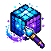
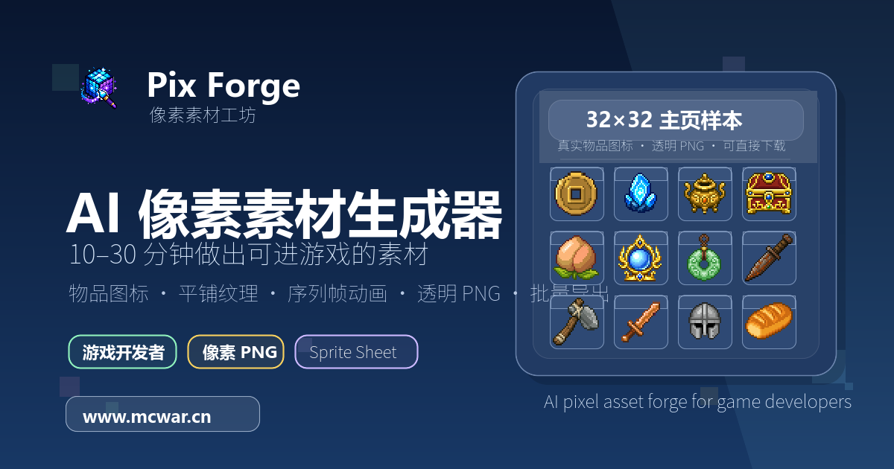
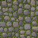
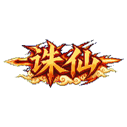
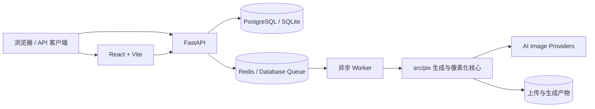

<div align="center">
  
  <h1>Pix Forge</h1>
  <p><strong>把 AI 生图锻造成可直接进入游戏工程的像素资产。</strong></p>
  <p>物品图标 · UI 组件 · 游戏 Logo · 平铺纹理 · Dual Grid · 角色设定 · Sprite Sheet</p>

  <p>
    <a href="https://github.com/zhibeigg/pix/actions/workflows/ci.yml"></a>
    <a href="https://github.com/zhibeigg/pix/releases"></a>
    <a href="LICENSE"></a>
    
    
  </p>

  <p>
    <strong><a href="https://www.mcwar.cn/">在线体验</a></strong>
    · <a href="#快速开始">快速开始</a>
    · <a href="#docker-部署">Docker 部署</a>
    · <a href="#对外-api">外部 API</a>
    · <a href="https://github.com/zhibeigg/pix/releases">下载发行版</a>
  </p>
</div>

<p align="center">
  <a href="https://www.mcwar.cn/"></a>
</p>

Pix 是一套面向**游戏开发者、独立工作室与像素美术生产流程**的 Web 像素资产平台。它不是简单的图片缩放器，而是把多家 AI 生图 Provider、像素网格检测、去背景、限色、尺寸规范化、序列帧处理、资产管理和生产运营整合成一条可部署的完整流水线。

仓库采用 React/Vite 前端、FastAPI 后端与 `src/pix` 图像处理核心，只保留网站生产运行所需代码；历史 CLI、桌面 GUI、旧素材与临时产物均已清理。

## 快速导航

| 目标 | 入口 |
|---|---|
| 直接体验产品 | [www.mcwar.cn](https://www.mcwar.cn/) |
| 本地启动前后端 | [快速开始](#快速开始) |
| 部署完整生产栈 | [Docker 部署](#docker-部署) |
| 接入自动化工作流 | [对外 API](#对外-api) |
| 理解素材处理逻辑 | [网站素材生成流水线](#网站素材生成流水线) |
| 查看安全边界 | [安全与防护](#安全与防护) · [SECURITY.md](SECURITY.md) |
| 参与开发 | [CONTRIBUTING.md](CONTRIBUTING.md) · [CHANGELOG.md](CHANGELOG.md) |
| 查看示例资产授权 | [ASSETS.md](ASSETS.md) |

## 核心能力

| 能力 | 说明 |
|---|---|
| **游戏素材直出** | 生成物品图标、UI 组件、游戏 Logo、角色三视图、平铺纹理与 Dual Grid 过渡瓦片。 |
| **像素级后处理** | 自动检测真实像素网格，执行 perfect pixel、纯色抠图、透明裁切、限色、描边与 2 的幂画布填充。 |
| **序列帧动画** | 支持 mosaic Sprite Sheet、首尾帧视频补间、逐帧对齐编辑、GIF 与多动作 ZIP 导出。 |
| **多 Provider 编排** | 将 logical model 映射到多家上游，按优先级自动切换，并记录脱敏诊断与供应商成功率。 |
| **完整 Web 产品** | 内置账号、点数、月卡、支付、作品库、角色库、公开分享、内容审核与运营后台。 |
| **开放 API** | 提供长期 API Key、细粒度 scope、幂等任务创建、批量生成、上传、轮询与安全下载。 |
| **可验证发布** | GitHub Actions 自动测试、构建 Release 与 GHCR 镜像，并生成 SHA-256 和 SLSA provenance。 |

## 生成效果

<table>
  <tr>
    <td align="center" width="25%">
      <br>
      <strong>物品图标</strong><br><sub>透明 PNG · 小尺寸高识别度</sub>
    </td>
    <td align="center" width="25%">
      <br>
      <strong>平铺纹理</strong><br><sub>四边无缝 · 可重复铺设</sub>
    </td>
    <td align="center" width="50%">
      <br>
      <strong>游戏 Logo</strong><br><sub>宽幅画布 · 透明背景</sub>
    </td>
  </tr>
  <tr>
    <td colspan="3" align="center">
      <br>
      <strong>Sprite Sheet</strong> · 连贯动作帧、共享角色设计与可直接导出的动画序列
    </td>
  </tr>
</table>

## 技术架构



生成任务通过数据库队列或 Redis/RQ 异步执行；API 主进程负责认证、计费、任务编排和文件权限，Worker 调用 `src/pix` 完成生图、像素化与产物落盘。

## 仓库结构

```text
apps/web/                           # React/Vite 前端
apps/web/public/homepage-examples/  # 主页示例与 README 展示资产
migrations/                         # Alembic 数据库迁移
src/pix/                            # 素材生成、像素化与序列帧核心
src/pix_web/                        # FastAPI、worker、账号、计费与任务系统
src/pix/pixelize/presets/           # 随 Python 包分发的像素化预设
config.example.toml                 # Pix 核心可选配置示例
.env.example                        # 本地开发环境变量示例
.env.production.example             # Docker / 生产环境变量示例
Dockerfile / docker-compose.yml      # 后端镜像与整站编排
```

> [!NOTE]
> Web 后端同时依赖 `src/pix_web` 与 `src/pix`。其中 `pipeline.py`、`pixelize/*`、`grid/*`、`sprite_mosaic.py` 和 `sprite_video_bridge.py` 等模块共同组成实际生产流水线。

## 快速开始

### 环境要求

| 依赖 | 版本 / 用途 |
|---|---|
| Python | 3.10、3.11 或 3.12 |
| [uv](https://docs.astral.sh/uv/) | Python 依赖与虚拟环境管理 |
| Node.js | 22.12 或更高版本 |
| PostgreSQL / Redis | 本地可选，生产环境推荐 |

### 启动后端

使用 `uv.lock` 安装可复现的开发环境：

```bash
uv sync --frozen --extra dev
cp .env.example .env
uv run pix-web-api
```

项目支持 Python 3.10、3.11 和 3.12。发布前可运行 `uv run python scripts/check_release_version.py` 校验所有版本文件。

常用后端命令：

```bash
pix-web-api           # 启动 FastAPI 开发服务，默认 127.0.0.1:8000
pix-web-worker        # 数据库队列 worker
pix-web-rq-worker     # Redis/RQ worker
pix-web-check         # 后端配置/环境检查
```

### 启动前端

```bash
cd apps/web
npm ci
npm run dev
```

开发环境默认由 Vite 提供前端热更新，FastAPI 提供后端接口；跨源访问时请同步配置 `PIX_WEB_CORS_ORIGINS`。

<details>
<summary><strong>前端交互与批量生产说明</strong></summary>

全站图片预览（作品库、生产工作台、角色库、微调工位、批量生成、原始生图页、落地页示例等）都支持「放大查看」：鼠标悬停预览区（触摸设备常显）时右上角出现放大按钮，点击进入全屏 Lightbox，可滚轮缩放、拖拽平移、双击缩放、双指捏合缩放、ESC 关闭。像素成品用锐利渲染（`pixelated`），原始 AI 生图用平滑渲染（`auto`）。放大按钮会阻止事件冒泡，不影响画廊卡片选择等交互。

主页「范例图鉴」包含物品图标、真实上游实测样例、平铺纹理和序列帧；登录后还会出现「用户分享」tab，仅展示管理员审核通过的用户作品，并可按实际输出尺寸、生图模型和直出类型快速筛选。序列帧分享会在卡片中按帧播放，并在用户分享筛选上以「序列帧」分类展示；参数按钮使用与作品库一致的分组弹窗展示公开快照。主体类素材的尺寸重试支持前端全部默认像素尺寸档位（16/24/32/48/64/96/128/256），按透明成品尺寸匹配 `pixelize.output_size`。用户在作品库点击「提交审核」后，作品先进入待审核队列，管理员通过后才会展示在首页、允许其他登录用户点赞/下载，并在通过时发放分享奖励。实测样例会展示本地真实流程生成的 Logo / 技能书结果，并在卡片和筛选器中标注使用的生成模型（如 `image2`、`gemini-3.1-flash-image-preview`），静态图片位于 `apps/web/public/homepage-examples/showcase/`。

生产工作台「游戏素材直出」支持一次提交 1～8 张同参数素材（物品图标、UI 组件、平铺纹理、Logo、双瓦片、角色和参考图重绘）。普通素材 / UI / Logo / 角色的参考图上传支持多选：一次上传几张参考图就生成几张同参数图生图任务，每张任务使用对应参考图并独立排队、冻结点数、进入作品库；无参考图时仍可用「生成数量」手动抽多张。前端会显示总价；提交时复用 `/jobs/batch` 创建多个独立 `asset` 任务，因此每张作品独立排队、冻结点数、进入作品库、下载、分享、保存角色或重试。

</details>

### 构建前端

```bash
cd apps/web
npm run build
```

## Docker 部署

1. 复制生产环境变量：

   ```bash
   cp .env.production.example .env.production
   ```

2. 修改 `.env.production` 中的数据库密码、JWT secret、生图 Provider API key（推荐 Crazyrouter，可保留 Packy fallback）、邮件与支付配置。
3. 启动：

   ```bash
   docker compose --env-file .env.production up --build
   ```

默认服务：

- `web`：Nginx 托管前端，默认宿主机 `8080`。
- `api`：FastAPI 后端。
- `worker`：RQ 生成任务 worker。
- `postgres` / `redis`：生产编排依赖。

### 自动发布与容器镜像

推送形如 `vA.B.C` 的标签后，GitHub Actions 会先重新执行安全扫描、测试和构建，再创建 GitHub Release：

- Python wheel 与 sdist；
- `pix-web-A.B.C.zip` 前端静态包；
- `SHA256SUMS` 与 GitHub artifact provenance；
- `ghcr.io/zhibeigg/pix-backend:A.B.C`；
- `ghcr.io/zhibeigg/pix-web:A.B.C`。

镜像同时提供 major/minor 与 `latest` 标签。可用 `sha256sum -c SHA256SUMS` 校验下载文件，用 `gh attestation verify` 验证 GitHub 制品或 GHCR 镜像来源。

> PyPI 上的 `pix` 名称已被其他项目占用，因此本项目只通过 GitHub Release 分发 Python 安装包，不会自动发布 PyPI。

## 关键环境变量

| 变量 | 用途 |
|---|---|
| `CRAZYROUTER_API_KEY` | 推荐的生图 Provider API key；当前生图模型选择收敛为 `image2`、`gemini-3.1-flash-image-preview`、`gemini-3-pro-image-preview`。 |
| `CRAZYROUTER_BASE_URL` | Crazyrouter API Base URL，默认 `https://crazyrouter.com`。 |
| `SHENGSUANYUN_API_KEY` | 胜算云（ShengSuanYun）生图 Provider API key，异步任务协议、承载 `image2`（上游 `openai/gpt-image-2`）；provider priority 第二（介于 Packy 与 Crazyrouter 之间），自动参与失败切换。 |
| `SHENGSUANYUN_BASE_URL` | 胜算云 API Base URL，默认 `https://router.shengsuanyun.com`。 |
| `PIX_IMAGE_DEFAULT_MODEL` | 默认 logical 生图模型，建议 `image2`；可选值仅为 `image2`、`gemini-3.1-flash-image-preview`、`gemini-3-pro-image-preview`。 |
| `PIX_IMAGE_PROVIDERS_JSON` | 可选：用 JSON 覆盖/补充多 Provider 配置，适合容器密钥管理场景。 |
| `ARK_API_KEY` / `VOLCENGINE_ARK_API_KEY` | 可选：启用 `sprite.mode="video_bridge"` 首尾帧视频补间时使用的火山方舟 API Key；也可在后台「视频补间」配置。 |
| `PIX_VIDEO_BRIDGE_ENABLED` | 可选：设为 `true` 后允许创建首尾帧视频补间序列帧任务。 |
| `PIX_VIDEO_BRIDGE_MODEL` / `PIX_VIDEO_BRIDGE_BASE_URL` / `PIX_VIDEO_BRIDGE_DURATION` | 可选：覆盖 Ark Seedance 模型、Base URL 和旧版视频秒数兜底值；`sprite.mode="video_bridge"` 实际提交 Ark 的秒数会按 `rows×cols × duration_ms` 自动推导，再向上吸附到 `[video_bridge].allowed_durations`（默认 Seedance 价格计算器 4–15 秒完整档位）中最近的合法档位。 |
| `PACKY_API_KEY` | Packy 老部署兼容 / 首次导入「上游供应商」种子 / fallback Provider 的生图 API key；新部署请优先在后台「上游供应商」配置。 |
| `PACKY_VL_API_KEY` | 视觉模型旧变量，老部署兼容 / 首次导入用，可与 `PACKY_API_KEY` 共用。 |
| `PACKY_BASE_URL` | Packy 旧 Base URL，老部署兼容 / 首次导入用，默认 `https://www.packyapi.com`。 |
| `PIX_WEB_DATABASE_URL` | 后端数据库连接。开发可用 SQLite，生产建议 PostgreSQL。 |
| `PIX_WEB_DB_POOL_SIZE` | PostgreSQL 连接池常驻连接数，默认 10（SQLite 忽略）。 |
| `PIX_WEB_DB_MAX_OVERFLOW` | 连接池允许的临时溢出连接数，默认 20；峰值连接上限 = size + overflow。 |
| `PIX_WEB_DB_POOL_TIMEOUT` | 取连接的最大等待秒数，默认 30；超时即报错而非无限堆积。 |
| `PIX_WEB_DB_POOL_RECYCLE` | 连接最大存活秒数，默认 1800，超过即回收，配合 pre_ping 防服务端空闲断连。 |
| `PIX_WEB_JWT_SECRET` | 登录 token 签名密钥，生产必须替换为长随机值。浏览器端不会读取该 token，而是通过 HttpOnly Cookie 维持会话。 |
| `PIX_WEB_SESSION_COOKIE_SECURE` | 浏览器会话 Cookie 是否仅通过 HTTPS 发送；留空时 `prod` 自动开启、`dev` 自动关闭，生产显式关闭会拒绝启动。 |
| `PIX_WEB_SESSION_COOKIE_SAMESITE` | 浏览器会话 Cookie 的 SameSite 策略，支持 `lax` / `strict` / `none`，默认 `lax`；跨站部署使用 `none` 时必须同时启用 Secure。 |
| `PIX_WEB_STORAGE_ROOT` | 用户上传、生成结果和任务文件根目录，默认 `web_outputs`。 |
| `PIX_WEB_MAX_UPLOAD_BYTES` | 单张上传图片大小上限（字节），默认 `10485760`（10 MB）。前端会通过 `/settings/image-models` 读取该值做上传前置校验与提示，后端 storage 层仍是最终防线。 |
| `PIX_WEB_QUEUE_BACKEND` | `database` 或 `rq`。生产推荐 `rq`。 |
| `PIX_WEB_WORKER_CONCURRENCY` | Worker 并发任务数。 |
| `PIX_WEB_RUNNING_JOB_TIMEOUT_MINUTES` | running 任务自动清理阈值，默认 60 分钟；超时会标记失败并退款。 |
| `PIX_WEB_RUNNING_JOB_CLEANUP_INTERVAL_SECONDS` | Worker 扫描超时 running 任务的间隔，默认 60 秒。 |
| `PIX_WEB_REDIS_URL` | RQ/Redis 连接。 |
| `PIX_WEB_PIX_CONFIG` | 可选：让 Web worker 加载指定 `config.toml`。 |
| `PIX_WEB_PUBLIC_BASE_URL` | 后端公开 URL，例如 `https://example.com/api`；支付回调和链接推导会使用。 |
| `PIX_WEB_FRONTEND_BASE_URL` | 前端公开 URL；公告邮件按钮优先使用它，留空时从 `PIX_WEB_PUBLIC_BASE_URL` 推导。 |
| `PIX_WEB_CORS_ORIGINS` | 前后端不同源部署时填写允许的 Origin，多个用逗号分隔。 |
| `PIX_WEB_EMAIL_PROVIDER` | 邮件发送方式，开发可用 `console`，生产公告通知和验证码建议使用 `smtp`。 |
| `PIX_WEB_SMTP_HOST` / `PIX_WEB_SMTP_PORT` / `PIX_WEB_SMTP_FROM` | SMTP 投递配置；系统公告邮件和注册验证码共用。 |
| `PIX_WEB_TURNSTILE_ENABLED` | 是否启用 Cloudflare Turnstile 自适应反刷码；启用后仅同邮箱 / 同 IP 频繁请求验证码时触发，默认关闭。 |
| `PIX_WEB_TURNSTILE_SITE_KEY` | Turnstile Site Key，前端可见。 |
| `PIX_WEB_TURNSTILE_SECRET_KEY` | Turnstile Secret Key，仅后端校验使用，建议放密钥管理。 |
| `PIX_WEB_TURNSTILE_EMAIL_WINDOW_SECONDS` / `PIX_WEB_TURNSTILE_EMAIL_MAX_WITHOUT_CHALLENGE` | 同邮箱验证码请求触发 Turnstile 的统计窗口和免校验次数，默认 `3600` 秒 / `2` 次。 |
| `PIX_WEB_TURNSTILE_IP_WINDOW_SECONDS` / `PIX_WEB_TURNSTILE_IP_MAX_WITHOUT_CHALLENGE` | 同 IP 验证码请求触发 Turnstile 的统计窗口和免校验次数，默认 `3600` 秒 / `5` 次。 |

更多配置见 `.env.example`、`.env.production.example` 和 `config.example.toml`。

### 输入长度限制配置

后台「素材默认值」和「序列帧」现支持调整 Web 表单与外部 API 共用的描述长度限制：`pix.asset.subject_max_chars`、`pix.asset.extra_prompt_max_chars`、`pix.sprite.subject_max_chars`、`pix.sprite.row_prompt_max_chars`。同名字段也可写入 `config.toml` 的 `[asset]` / `[sprite]` 段。公开接口 `GET /settings/image-models` 与外部 API `GET /external/v1/models` 会在 `limits` 中返回当前生效值，前端据此显示字数计数、超限提示并禁用提交；后端创建任务、批量创建和失败重试也会按同一配置二次校验。

### 首尾帧视频补间序列帧

序列帧任务默认仍为 `sprite.mode = "mosaic"`。启用 `[video_bridge]` / 后台「视频补间」并配置 Ark Key 后，可提交 `sprite.mode = "video_bridge"`：系统先按 Seedance 官方提示词结构生成首尾关键帧图，再通过火山方舟 Ark / Seedance 首尾帧图生视频异步接口创建视频任务；Ark payload 会在 `content` 中分别提交 `role = "first_frame"` 与 `role = "last_frame"`，任务成功后从 `content.video_url` 下载 MP4。创建视频前会先对双栏整条横轴逐像素扫掠：跳过开头同色背景，确认主体杂色段，再在主体后的同色空隙与下一段杂色之间取中线切分首/尾帧，避免尾帧后腿、披风、武器尖端、粒子或烟雾越过几何中线时被裁掉；随后整理首/尾输入帧，并按 `rows×cols × duration_ms` 推导 Ark 视频秒数、再向上吸附到 `[video_bridge].allowed_durations`（默认 Seedance 价格计算器 4–15 秒完整档位）中不小于它的最近档位并锁定（避免 1s/2s 这类被上游以 `InvalidParameter` 拒绝的非法值；抽帧仍按均匀采样取 N 帧，视频档位被拉长不影响最终 GIF / 序列帧播放节奏），让视频补间时间轴和最终播放节奏一致；在 `PACKY_VL_API_KEY` 可用时调用 VL 模型读取首尾帧、优化动作补间计划；OpenAI 兼容模型会 POST `/v1/chat/completions`，Claude / Anthropic 模型会直接使用 Anthropic 消息协议 POST `/v1/messages`。最终 motion prompt 会强制动作小步均匀连贯、每一帧保持清晰方块像素格、无抗锯齿/模糊/绘画化，并明确要求所有像素方块必须保持横平竖直、不得通过旋转/倾斜/斜切像素块来模拟动作，同时要求只有 flat key-color 背景可以接触画布边缘，任何非背景/非 key-color 像素（主体、武器、烟雾、粒子、阴影、高光、拖尾和特效）都必须留在内部安全区；若请求设置 `sprite.video_return_to_first_frame = true`，还会要求视频先到达尾帧姿势，再平滑回到首帧，并在提交 Ark 时把最终约束帧切换为首帧，让最后采样帧匹配初始帧以便循环播放；后处理还会在最终透明帧四周强制保留安全透明边，并按不小于 perfectPixel 检测尺寸与 `pixelize.output_size` 的最小 2 的幂 1:1 方形画布透明填充（不缩放内容，例如 106×106 → 128×128），避免成品帧前景触边。VL 不可用或解析失败时自动回退本地硬约束 prompt。视频生成期间任务状态为 `waiting`，不会长时间占用本地 worker；到达 `next_poll_at` 后数据库 worker 或 RQ 清理循环会重新捞取任务继续轮询；轮询或下载阶段若遇到 Ark/上游网关、网络、超时等可重试错误，会记录 `last_transient_error` 并延后 `next_poll_at` 继续保持 `waiting`，不直接失败或退款。成功后会立即下载临时视频并抽帧，输出仍兼容现有序列帧契约：`sprite_sheet.png`、`sprite_sheet_grid.png`、`frames/`、可选 `sprite.gif`、`sequence.json` 和 `meta.json`。

外部 API 示例见前端 API 页「创建序列帧任务」；分页查询的 `status` 可包含 `waiting`。

若动画不需要明确的尾姿势（例如待机、呼吸、轻微摆动），可在 `sprite.mode="video_bridge"` 时传 `sprite.video_first_frame_only=true`。该模式生图阶段只生成并提交 `first_frame`，不再生成/提交单独 `last_frame`，随后仍会创建 Ark 首帧图生视频任务、按 `rows×cols` 抽帧输出完整序列帧；这样可减少生图模型生成的首尾关键帧在大小、脚底位置或主体中心上不一致导致的动画抖动。它仍要求 `[video_bridge].enabled` 与 Ark API Key，计费也仍按所选视频模型和推导视频秒数计算。

生产工作台默认进入「连贯动作序列帧（video_bridge）」而不是旧的素材/快速 mosaic 模式；后端 schema 为兼容历史请求，`SpriteParamsSchema.mode` 默认仍保留 `mosaic`。视频补间模式提供**动画预设**（帧数×FPS 组合）供直接选择，无需手动计算视频时长：轻量循环（8帧@8fps）、标准动作（8帧@6fps）、流畅动作（16帧@10fps）、丝滑动作（16帧@8fps，默认）、长演出（24帧@8fps），以及「自定义」；勾选「仅生成首帧关键图」时仍保留视频模型 / 动画预设 / rows×cols / FPS 控件，只改变关键帧生成方式。选择预设会自动设置 `rows×cols` 与 `fps`，并实时按前端复刻的档位吸附逻辑展示「提交 Ark 视频 Xs · 播放约 Ys」；自定义模式下调整行列 / FPS 也会实时更新推导结果。

`video_bridge` 支持在 `sprite.video_model` 中选择三档 Seedance 2.0 视频模型并透传给 Ark：`doubao-seedance-2-0-260128`（Standard，默认）、`doubao-seedance-2-0-fast-260128`（Fast）、`doubao-seedance-2-0-mini-260615`（Mini）。点数来自飞书价格计算器的 480p、16:9、输入不含视频、4–15 秒「视频价格」，统一按 `ceil(视频价格 × 20 + 10)` 精确计算；对应点数为 Standard 47/57/66/75/84/94/103/112/121/131/140/149，Fast 40/48/55/62/70/77/85/92/100/107/114/122，Mini 29/34/38/43/47/52/57/61/66/70/75/80。视频补间按所选模型和实际提交时长的单任务价计费，不再按 `ceil(rows·cols / 9)` 帧组数乘序列帧基础价；`sprite.video_first_frame_only=true` 仍使用同一视频价格表，只是生图阶段不再生成尾帧关键图。

### 角色库

登录用户可在「角色库」页面查看和管理长期保存的角色参考图。只有「素材直出 → 角色」（`job_type="asset"` 且 `asset.asset_kind="character"`）任务成功后会自动写入角色库；普通上传图、图生图、序列帧、普通素材作品和作品库卡片都不能手动保存为角色。角色库页面提供「生成角色」按钮，会跳转到生产工作台并预选「素材直出 → 角色」类型。角色库是独立持久资源，不占普通作品库保留格；角色记录只保存图片路径、预览路径、名称、说明、标签、源作品 ID 和安全参数快照，不会复制或移动原始产物。

角色库已接入统一文件归属校验：`/files` 访问、站内任务创建和外部 API 创建任务都只能引用当前用户自己的上传图、任务产物或角色库记录中的图片。序列帧表单的「参考来源」可在「从角色库选择」与「直接上传参考图」之间切换；最终提交仍写入 `sprite.reference_image_path`，因此 `sprite.mode="mosaic"` 与 `sprite.mode="video_bridge"` 复用现有后端链路。

角色库记录会锁定对应的角色素材源作品：普通作品库自动清理不会删除该源作品，用户手动删除源作品时会返回 409，需要先删除对应角色记录。删除角色只移除角色库记录，不会删除源作品产物。

站内角色 API：

| 方法 | 路径 | 说明 |
|---|---|---|
| `GET` | `/characters?limit=100` | 列出当前用户 `active` / `archived` 角色。 |
| `POST` | `/characters` | 仅兼容来自当前用户 `asset_kind=character` 像素直出任务的产物路径；普通上传图或非角色任务会返回 409。 |
| `POST` | `/characters/jobs/{job_id}` | 仅兼容当前用户已完成的 `asset_kind=character` 像素直出任务；`image_kind` 可选 `source` / `pixelized` / `preview`。 |
| `PATCH` | `/characters/{id}` | 更新名称、说明、标签或 `active` / `archived` 状态。 |
| `DELETE` | `/characters/{id}` | 软删除角色记录。 |

### 公开分享作品

作品库中的成功作品可点击「提交审核」进入管理员审核队列（`pending`），不会立即出现在首页。审核通过后状态变为 `active`，才会进入首页「用户分享」池；管理员也可以驳回为 `rejected`，作者在作品库查看驳回理由、修改后可重新提交。审核通过的分享会锁定源作品：作者不能自行下架分享，也不能删除源作品；如需下架或删除分享由管理员在后台「内容审核」执行。审核中（`pending`）的源作品同样禁止作者删除；`rejected` / `hidden` 仍可删除源作品，删除源作品或管理员删除分享时分享记录标记为 `deleted`。

公开/审核时后端会固化安全参数快照和下载清单，只展示用户可填写/选择的参数（提示词、素材类型、像素尺寸、颜色数、生图模型、序列帧 FPS 等），不会公开邮箱、内部 `run_dir`、诊断信息、系统 prompt 或密钥。首页「用户分享」筛选器会复用这些公开快照，并兼容旧分享从源任务参数回填生图模型。分享预览和下载链接使用短时效文件票据（query `token`）或 Bearer 鉴权，避免在 `` 中暴露长期登录 token；未登录用户不会看到首页「用户分享」tab，后端 `GET /shares` 也会返回 401。

分享奖励由后台「作品分享」系统设置管理：`share.reward_enabled` 控制是否奖励，`share.reward_credits` 控制每个作品首次审核通过返还点数（默认 1），`share.daily_reward_limit` 控制每用户每日最多获得多少次分享奖励（0 表示不限制）。奖励时机已从「提交分享」改为「管理员通过审核」，同一作品反复撤回/重新提交/重新通过不会重复返还。

公开分享 API：

| 方法 | 路径 | 说明 |
|---|---|---|
| `GET` | `/shares?limit=48&offset=0&asset_kind=item_icon&output_size=32x32&image_model=image2` | 需登录；只返回 `active` 分享，默认按点赞数、发布时间排序；支持按直出类型、像素尺寸、生图模型筛选，并返回 `liked_by_me` 与 `filters.asset_kinds` / `filters.output_sizes` / `filters.image_models` 选项数量。 |
| `POST` | `/shares/jobs/{job_id}/publish` | 当前用户提交自己的成功作品进入审核（`pending`）；`rejected` / `hidden` 可重新提交。 |
| `POST` | `/shares/{share_id}/unpublish` | 作者只能撤回自己的 `pending` / `rejected` 分享；`active` 只能管理员下架。 |
| `POST` / `DELETE` | `/shares/{share_id}/like` | 登录用户点赞 / 取消点赞，仅对 `active` 分享生效，后端幂等维护 `like_count`。 |
| `GET` | `/shares/{share_id}/preview` | 需文件票据或 Bearer；仅返回 `active` 分享预览。 |
| `GET` | `/shares/{share_id}/download/{kind}` | 需文件票据或 Bearer；根据固化下载清单下载 `active` 分享文件，不暴露任意 `/files?path=`。 |
| `GET` | `/admin/shares?status=pending|all` | 管理员审核列表，包含作者邮箱、预览 URL、参数快照和审核备注。 |
| `POST` | `/admin/shares/{id}/approve` / `/reject` / `/unpublish` | 管理员通过、驳回或下架分享；通过时按作者发放分享奖励。 |
| `DELETE` | `/admin/shares/{id}` | 管理员删除用户分享作品，软删除分享记录、清空点赞/下载计数并从公开池与后台非删除列表移除；不会删除用户源作品。 |
| `GET` | `/admin/shares/{id}/preview` | 管理员审核预览，需文件票据或 Bearer 且二次校验管理员身份，可查看非 `deleted` 分享。 |

> 老部署注意：后台「模型与 API」已移除旧 Packy / Gemini / VL 密钥入口，供应商密钥统一迁移到「上游供应商」。升级前请阅读 [`docs/deployment/legacy-provider-settings-migration.md`](docs/deployment/legacy-provider-settings-migration.md)。

## 系统公告与邮件通知

管理员在后台「系统公告」面板发布启用的新公告时，后端会为当前所有 `active` 用户邮箱排队发送一封 HTML 卡片邮件。邮件会展示公告标题、正文、发布时间和“打开 Pix 网站”按钮；按钮链接优先读取 `PIX_WEB_FRONTEND_BASE_URL`，未配置时会从 `PIX_WEB_PUBLIC_BASE_URL` 去掉 `/api` 后推导。相同标题和正文重复保存不会再次群发，下线公告或保存草稿也不会发送邮件。

公告邮件复用注册验证码的邮件配置：开发环境 `PIX_WEB_EMAIL_PROVIDER=console` 时只写入日志；生产环境请配置 `smtp`、`PIX_WEB_SMTP_HOST`、`PIX_WEB_SMTP_FROM`、TLS/SSL 和认证信息。

## 网站素材生成流水线

当前 `job_type = asset` 的网站直出流程是单图素材流水线，不再使用旧的“逐图补 64×64 / 32×32 outline”静态流程。

实际步骤：

1. `build_asset_prompt` 根据用户主体、素材类型、尺寸、颜色数和抠色容差构建 prompt。
2. 本地 prompt guard 只审核用户原始输入，不把服务端模板暴露给审核模型；“直接复刻/抄袭参考图”类请求会在创建任务前拒绝，不入队、不冻结点数，并写入策略审计事件供后台统计。
3. 使用当前配置的 logical 生图模型生成单张源图；同一模型可由 Crazyrouter、Packy 等多个 Provider 承载并自动失败切换。普通素材上传参考图时仍走 `job_type=asset` 的素材直出链路（按图生图价格计费）：后端先要求模型把参考图理解 / 转译为 TRUE pixel-art，再套用素材模板中的尺寸、颜色数、纯色背景、禁文字等约束重绘，避免退化成简单处理上传图。`asset_kind=character` 会按单个完整角色参考图约束生成，任务成功后自动保存到角色库。
4. 默认 `skip_vl = true`，不走普通 VL 分析。
5. Pixel Grid extract：
   - `perfect_pixel` 网格对齐，并保存 `02_perfect_pixel_preprocess.png`；
   - `remove_background` 去背景；默认使用参考项目 `pixel_bg` 方法：边框中位数探测 key 色，按 `t_core/t_grow` 双阈值连通域生长生成背景 mask，去 key 色溢色并输出硬边二值 alpha；也可选择 `color_to_alpha`，按背景 key 色距离生成软 alpha，适合高清原图保留抗锯齿边；
   - 序列帧任务（mosaic 单图模式）：1 次 API 调用直接产出 rows×cols 网格 sprite sheet（rows/cols 各最大 8）。后端会先按 rows×cols 与目标帧尺寸自动计算适合的 API 渲染分辨率（不再继承通用 `image_gen.size=1024x1024`；例如 4×8、64×64 会渲染到 3072×1536，4×8、48×64 会渲染到 3072×2048，满足最大边 ≤3840、16 倍数、长短边比 ≤3:1、总像素 ≤8.3M 等约束），让每个像素艺术像素至少占 8×8 / 6×6 渲染像素。生成后按格切图（整轴逐像素扫掠找真实 gutter：先跳过同色背景，经过主体杂色段后，在下一段同色空隙与再下一段杂色之间取中线，避免主体溢出、拖尾粒子或近似背景色特效被切断）+ 复用 `perfectPixel` + 显式 key 色的 pixel_bg 双阈值 alpha + 共享调色板等成熟后处理流程，最终输出横向 `sprite_sheet.png`（兼容预览）+ 原版 `sprite_mosaic.png`（保留 rows×cols 排版可下载）+ `sequence.json`。多行 mosaic（rows>1）会先按上下动作组切行，再在每行动作图内独立横向切帧，并额外输出 `sprite_sheet_grid.png`（rows×cols 二维网格预览）以及 `row_sheets/row_NN.png` + `previews/row_NN.gif`（每行一张横向 sheet + 一个独立动画 GIF），让 4×8 行走表这种「每行一个动作」的素材直接拿到 4 个独立动画。提供「角色参考图」时切换到 `edit_image`，让每个 cell 复用同一角色设计。作品库可打开「调整」编辑器：逐帧拖动主体、滚轮缩放、查看上一帧半透明影子并实时预览，保存时仅本地重合成（含 fps 与每帧 offset/scale），不重新生图也不额外扣点；
   - `auto_crop` / tight bbox 贴主体裁剪；
   - `transparent_canvas_pad` 补到预设尺寸档；
   - sample cells / cluster palette；
   - 渲染最终 PNG 与 `.grid.json`。

> 参考图微调（`job_type=image_to_image` 且会进入像素化的任务，如作品库「AI 微调」）现在与素材直出共用同一套像素风 prompt：复用 `build_asset_prompt` + 参考图 appendix，把上传图当参考图、按 TRUE pixel-art 重绘（不再把用户原文直接发给模型），并声明上传图即「图1」，用户可在提示词用「图1」指代参考图（如「把图1重绘成像素风戏台」）。作品库「AI 微调」会沿用原作品的素材类型（物品图标 / UI 组件 / Logo / 平铺纹理 / 角色）重绘，外部 API 也可在 `asset.asset_kind` 指定，缺省按物品图标处理。可用 `[image_gen].image_to_image_pixel_prompt = false` 回退原始 prompt 直传；`source_only` 的原生大图（参考图直出 1024 大图）不受影响。
>
> `job_type=local_bg_remove` 提供纯本地去背景，不调用 AI、不做像素化。`pixelize.bg_removal_algorithm="pixel_bg"` 对应前端「像素」算法（与像素直出当前抠色一致），`"color_to_alpha"` 对应「高清」算法（Color-to-Alpha 软边）。输出仍通过 `pixelized` 下载通道返回透明 PNG。

## 管理后台运营能力

管理后台「概览」展示今日任务、成功 / 失败、订单充值、今日消费、今日新增用户、DAU、今日付费用户、今日新订单、付费订单、上传量和失败诊断等核心运营指标。其中「订单充值」只汇总今日已支付订单的点数，不再把注册赠送或管理员补点计入充值数据；DAU 以今日注册、创建任务、上传或创建 / 支付订单的去重用户数统计。「今日新订单」按 `created_at` 统计（含未支付 `pending`），「付费订单」按 `paid_at` 只统计已支付，两者并列便于发现支付回调未到的订单。所有「今日」指标按**站点时区**（系统设置 `site.timezone`，默认 `Asia/Shanghai` = UTC+8）切分自然日，避免 UTC+8 用户凌晨—早 8 点的订单被算到前一天；概览在「概览」标签页每 30s 自动刷新，不再需要手动点「刷新」。

管理后台「用户与点数」支持单用户调整、当前用户列表多选、全选当前列表，以及通过 `POST /admin/users/adjust-credits-batch` 对全部 active 用户批量补点 / 扣点。批量操作会为每个目标用户写入独立 `adjustment` 点数流水，并在提交前显示目标范围、每人点数变化与备注，便于运营补偿或活动发放。用户列表还会展示每个用户的剩余点数 / 累计充值 / 累计消耗与月卡状态，并支持关键词搜索（邮箱 / 昵称 / #ID）与按剩余点数 / 已消耗 / 已充值 / 注册时间排序；后端 `GET /admin/users` 返回 `AdminUserResponse`，批量查 `CreditAccount` / `UserMembership` 组装余额与会员字段（避免 N+1），仅只读展示不改计费。

管理后台「订单」标签页总览全站充值 / 月卡订单：支持按状态（已支付 / 待支付 / 失败）、类型（充值 / 月卡）、关键词（邮箱 / 昵称 / 订单号 / #ID）筛选，以及按创建时间 / 金额 / 点数排序（升降序切换），顶部显示当前筛选下的已收总额。后端 `GET /admin/orders?limit=500` 返回 `AdminPaymentOrderResponse[]`，在订单字段上附带下单用户邮箱 / 昵称（批量查用户避免 N+1）。

管理后台「价格折扣」可开启全局点数折扣：设置 `pricing.discount_enabled` 开关、`pricing.discount_rate` 倍率（0~1，如 0.8 = 8 折，0 = 限免）与可选 `pricing.discount_label` 促销文案。折扣只作用于生成任务（asset / 文生图 / 图生图 / 序列帧），按「先算总价再打折、向下取整、原价>0 保底 1 点」扣点，并在创建任务时锁定；作品库 / 素材包扩容不受影响。前端通过公开接口 `GET /pricing/discount`（返回 `{active, rate, label}`）展示原价划线 + 折后价 + 折扣标签。折扣实扣点数会写入任务计费快照（`billing.original_total_points` / `total_points` / `discount`）。

管理后台「优惠链接」可创建带折扣的注册推广链接：设置优惠码、折扣倍率（0~1，如 0.8 = 8 折、0 = 限免、1 = 不打折）、启停与备注，生成形如 `https://站点/?promo=CODE#auth-panel` 的链接。通过该链接注册的用户会**永久绑定**优惠码，之后所有充值 / 自定义充值 / 月卡订单都按折扣倍率支付（折扣只作用于**付款金额** `amount_cents`，到账点数 / 月卡额度不变），并在下单时锁定 `payment_orders.promo_code` 供审计与统计。与邀请返佣（`?aff=`）独立并存：`?aff=` 是好友充值后邀请人拿返佣，`?promo=` 是注册即绑定的长期折扣。后端 `GET/POST/PUT/DELETE /admin/promo-links` 提供增删改查与使用量统计（注册数、绑定用户数、下单数、付费订单数、付费金额），公开接口 `GET /pricing/promo/{code}` 返回优惠码是否有效及折扣供注册页展示。折扣倍率、绑定关系与统计以数据库 `promo_links` 表为准（迁移 `0025`），用户表 `users.promo_code` 记录绑定的优惠码。

月卡会员提供仅用于生成任务的每日临时额度，默认档位为铜卡 100 点/天（¥99 / 30 天）、银卡 200 点/天（¥199 / 30 天）、金卡 300 点/天（¥299 / 30 天）。用户可在「点数中心」购买月卡；重复购买会在当前到期日基础上顺延，并可切换档位。临时额度按站点时区（`site.timezone`，默认 `Asia/Shanghai`）每日自然日刷新，当天未用完会清零；创建生成任务时按「临时额度 → 永久点数」顺序冻结，不足时可混合扣点，任务成功确认消费，失败同日退回临时额度，跨日临时额度退款作废并写入流水备注。作品库 / 素材包扩容等一次性消费仍只使用永久点数。管理后台「月卡档位」可调整档位名称、每日额度、价格、天数、启停和排序。余额接口额外返回 `daily_quota_balance`、`daily_quota_limit`、`reserved_quota`、`available_total`、`membership_plan_key`、`membership_expires_at` 等字段。

管理后台「任务与作品」支持按作品库视角查看最新全站任务：管理员可按状态、用户、任务 ID / prompt / 批次 / 用户邮箱筛选，并直接预览、下载任务产物；同页保留操作列表用于重试失败任务、取消排队 / 运行任务并退款、标记失败并退款。后端 `GET /admin/jobs?limit=500` 返回 `JobResponse[]`，其中 `user_id` 暴露任务归属，`outputs` 继续包含受保护文件 URL；管理员前端使用自己的登录 token 调用 `/files` 打开这些产物。

管理后台「性能监控」面板提供生图任务的实时可观测：成功率、活跃并发、任务量与成功率时间序列、提供商成功率对比、失败分类与最近任务流，可在 `1h / 24h / 7d` 范围间切换，前端每 8 秒轮询刷新。数据来自后端 `GET /admin/performance-metrics` 聚合接口；提供商成功率以后台已添加的 `image_providers` 为基准，优先读取任务 meta / diagnostics 中的 provider 尝试历史，因此 fallback 中前置失败供应商和最终成功供应商都会计入各自统计。

管理后台「上游供应商」面板统一管理生图上游：从内置预设（胜算云 / Packy / Crazyrouter / OpenAI / Midjourney / Ideogram / Fal / Kling）或「自定义（OpenAI 兼容）」一键新增供应商，填入 API Key 即可；支持编辑、删除、启停与调整 `priority`。供应商配置以数据库 `image_providers` 表为单一真相源（迁移 `0017`），后端 `GET/POST/PUT/DELETE /admin/providers` 提供增删改查、`GET /admin/providers/presets` 返回预设目录。首次启动会把 `config.toml` 的 `[[image_providers]]` 与 `.env` 各家 Key 导入数据库做种子；之后改动即时生效、无需重启（worker 每个任务都通过 `load_managed_pix_config` 重新加载有效配置并叠加数据库供应商）。API Key 写入后仅展示「已配置 / 未配置」状态、提交空值保持不变，与其它密钥设置一致。

## 对外 API

普通用户登录后可在网站「API」页面创建、停用或删除长期 API Key，并查看详细调用文档与 `curl` 示例。页面内置类似 sub2api 的令牌生成器：先在浏览器生成 `pix_live_` + 32 字节随机 hex 的候选令牌，提交创建后才生效；后端会校验格式与唯一性，数据库只保存 hash 与 prefix。API Key 明文只在创建成功时展示一次；列表页只展示名称、prefix、scope、创建时间、最后使用时间和撤销时间。外部程序使用 `Authorization: Bearer <api_key>` 调用 `/external/v1/...`，任务仍归属该 key 对应用户，并复用现有任务创建、扣点预留、队列入队、作品权限、角色库权限和文件下载逻辑。API 页面已覆盖认证、账号 / 余额 / 模型查询、上传参考图、角色库读写、素材直出、多张同参数素材直出、图生图、序列帧、轮询分页和下载输出等接入步骤。

网站 SPA 登录与外部 API 认证相互独立：浏览器登录使用 `HttpOnly` 会话 Cookie，并对 Cookie 认证的写请求校验精确 `Origin`；现有 `/auth/login` Bearer JWT 与 `/external/v1` 的 `pix_live_` API Key 接口继续保留，便于 CLI、服务端程序和旧客户端兼容。

外部 API 也提供 `POST /external/v1/jobs/batch`，请求体与站内 `/jobs/batch` 一致：`jobs` 为 1～50 个 `JobCreateRequest`，`batch_name` / `mode` 可选。用于多张同参数素材直出时，调用方应复制同一 `job_type="asset"` payload 并为每个子任务设置不同 `client_request_id`；响应 `JobBatchCreateResponse` 会返回独立 `jobs[]`、`total_price_credits` 和 `batch_id`。

`JobCreateRequest` 可选 `style_profile` 项目风格档案：`project_name`、`palette`、`line_style`、`lighting`、`view_rule`、`avoid_elements`。这些字段会由后端统一编译为 prompt 补充约束，用于素材直出、平铺纹理、双瓦片和序列帧；它不会替换像素尺寸、纯色背景、无缝瓦片或序列帧布局等硬约束。站内用户还可调用 `POST /jobs/prompt-preview` 在扣点前查看真实合成后的 prompt（外部 API 创建任务仍走 `/external/v1/jobs`）。

可分配的 scope：

- `me:read` / `balance:read` / `models:read`：查询账号、余额与可用模型；
- `uploads:create`：上传参考图 / 输入图，供后续任务 payload 使用；上传图不会直接进入角色库；
- `jobs:create`：创建素材直出、文生图、图生图、本地像素化、本地去背景、重新像素化、序列帧等任务；
- `jobs:read`：查询自己的任务列表与任务详情；
- `files:read`：下载自己的任务输出或序列帧动作 zip；
- `characters:read`：读取当前账号角色库；
- `characters:write`：更新、删除角色，或从已完成的 `asset_kind=character` 像素直出任务创建角色记录。

外部角色库 API：

| 方法 | 路径 | Scope | 说明 |
|---|---|---|---|
| `GET` | `/external/v1/characters?limit=100` | `characters:read` | 列出当前 API Key 所属账号的角色库。 |
| `POST` | `/external/v1/characters` | `characters:write` | 仅兼容来自当前账号 `asset_kind=character` 像素直出任务的产物路径；普通上传图或非角色任务会返回 409。 |
| `POST` | `/external/v1/characters/jobs/{job_id}` | `characters:write` | 仅兼容当前账号已完成的 `asset_kind=character` 像素直出任务。 |
| `PATCH` | `/external/v1/characters/{id}` | `characters:write` | 更新名称、说明、标签或归档状态。 |
| `DELETE` | `/external/v1/characters/{id}` | `characters:write` | 软删除角色记录。 |

常用调用示例：

```bash
# 创建任务（Idempotency-Key 可选；相同 key 会复用同一任务）
curl -X POST "https://example.com/api/external/v1/jobs" \
  -H "Authorization: Bearer pix_live_xxx" \
  -H "Content-Type: application/json" \
  -H "Idempotency-Key: sword-001" \
  -d '{
    "job_type": "asset",
    "asset": {"name": "blue magic sword", "asset_kind": "item_icon"},
    "style_profile": {
      "project_name": "Crystal Dungeon",
      "palette": "cyan, violet, deep navy",
      "line_style": "thin bright outline",
      "avoid_elements": "modern guns, watermark, text"
    },
    "pixelize": {"output_size": [32, 32], "colors": 8, "remove_bg": true},
    "skip_vl": true
  }'

# 创建角色素材：成功后会自动进入角色库
curl -X POST "https://example.com/api/external/v1/jobs" \
  -H "Authorization: Bearer pix_live_xxx" \
  -H "Content-Type: application/json" \
  -H "Idempotency-Key: character-001" \
  -d '{
    "job_type": "asset",
    "asset": {"name": "blue cloak knight", "asset_kind": "character", "subject_kind": "single_character"},
    "pixelize": {"output_size": [64, 64], "colors": 32, "remove_bg": true},
    "skip_vl": true
  }'

# 多张同参数素材直出：每个子任务独立入队、扣点和进入作品库
curl -X POST "https://example.com/api/external/v1/jobs/batch" \
  -H "Authorization: Bearer pix_live_xxx" \
  -H "Content-Type: application/json" \
  -d '{
    "batch_name": "blue sword draws",
    "mode": "asset_multi",
    "jobs": [
      {"job_type":"asset","client_request_id":"sword-001","asset":{"name":"蓝色魔法剑","asset_kind":"item_icon"},"pixelize":{"output_size":[32,32],"colors":8,"remove_bg":true},"skip_vl":true},
      {"job_type":"asset","client_request_id":"sword-002","asset":{"name":"蓝色魔法剑","asset_kind":"item_icon"},"pixelize":{"output_size":[32,32],"colors":8,"remove_bg":true},"skip_vl":true},
      {"job_type":"asset","client_request_id":"sword-003","asset":{"name":"蓝色魔法剑","asset_kind":"item_icon"},"pixelize":{"output_size":[32,32],"colors":8,"remove_bg":true},"skip_vl":true}
    ]
  }'

# 查询任务
curl "https://example.com/api/external/v1/jobs/{job_id}" \
  -H "Authorization: Bearer pix_live_xxx"

# 上传参考图 / 本地输入图
curl -X POST "https://example.com/api/external/v1/uploads/images" \
  -H "Authorization: Bearer pix_live_xxx" \
  -F "file=@reference.png"

# 角色库：读取自动保存的角色；只有 asset_kind=character 的像素直出任务能成为角色
curl "https://example.com/api/external/v1/characters?limit=100" \
  -H "Authorization: Bearer pix_live_xxx"

curl -X POST "https://example.com/api/external/v1/characters/jobs/{character_asset_job_id}" \
  -H "Authorization: Bearer pix_live_xxx" \
  -H "Content-Type: application/json" \
  -d '{"name":"blue knight","image_kind":"pixelized"}'

# 创建本地去背景任务（algorithm: pixel_bg=像素；color_to_alpha=高清）
curl -X POST "https://example.com/api/external/v1/jobs" \
  -H "Authorization: Bearer pix_live_xxx" \
  -H "Content-Type: application/json" \
  -H "Idempotency-Key: bg-remove-001" \
  -d '{
    "job_type": "local_bg_remove",
    "input_image_path": "把上传接口返回的 path 填在这里",
    "pixelize": {"remove_bg": true, "bg_removal_algorithm": "color_to_alpha"}
  }'

# 下载任务输出（kind 可用 source、pixelized、preview、sprite-sheet、sprite-mosaic、sprite-grid）
curl -L "https://example.com/api/external/v1/jobs/{job_id}/outputs/pixelized" \
  -H "Authorization: Bearer pix_live_xxx" \
  -o output.png

# 下载序列帧动画 GIF（按当前活跃帧实时合成，生成时无需开启 gif_export）
curl -L "https://example.com/api/external/v1/jobs/{job_id}/outputs/sprite-gif" \
  -H "Authorization: Bearer pix_live_xxx" \
  -o sprite.gif

# 下载多行动作序列帧 zip
curl -L "https://example.com/api/external/v1/jobs/{job_id}/outputs/sprite-actions.zip" \
  -H "Authorization: Bearer pix_live_xxx" \
  -o sprite-actions.zip
```

## 通用生图 Provider 调用规范

Pix 现在通过 logical model → provider candidates 的方式调用生图上游。前端和 `/settings/image-models` 只开放 3 个 logical model：`image2`、`gemini-3.1-flash-image-preview`、`gemini-3-pro-image-preview`；旧配置中的 `gpt-image-2` 会自动归一为 `image2`，但上游真实 `provider_model` 仍可保持 `gpt-image-2` / `openai/gpt-image-2`。同一个模型可以同时映射到多家 Provider，运行时按 `priority` 排序（默认 Packy=10 → 胜算云=20 → Crazyrouter=30）；网络错误、超时、429/5xx、空响应、响应结构异常、Provider 临时不可用、鉴权/余额类错误会自动切换下一家，直到没有其它可用 Provider。策略拦截、非法请求或不支持的模型/操作不会切换，避免浪费额度或绕过安全策略。普通用户只看到安全简短失败提示；管理员后台可查看脱敏后的 Provider 尝试历史、失败分类和 traceback。

OpenAI Images 兼容模型走 `/v1/images/generations` / `/v1/images/edits` 或 `image_input` payload；Midjourney、Kling 这类异步协议会提交任务后轮询查询端点；胜算云（`shengsuanyun` 协议）用 OpenAI gpt-image 兼容请求体走异步任务流程（`POST /api/v1/tasks/generations` 提交、`GET /api/v1/tasks/generations/{id}` 轮询，图生图复用同端点仅多传 `image` 字段，结果只返回图片 URL）；Ideogram/FAL 使用各自专用路径。默认优先要求返回 `b64_json` 并直接落盘；如果上游只返回临时 `url`，才作为兼容兜底下载。为控制上游成本，素材任务默认关闭多候选图；仅在后台或配置显式开启 `image_gen.contact_sheet_enabled` 时，才会按 `n_sample_count` 发起多候选请求。

候选 VL 评分未显式配置 `candidate_vl_ranking_model` 时固定使用 `claude-opus-4-8`，评分时直接以 multipart 文件上传候选图片给模型，不再把候选图编码成 chat `image_url` / 网格占位结构。`local_pixelize` 本地重处理会整体按生成图源图处理：重新走 perfect pixel、去背景、裁切等后处理，并在 perfect pixel 成功时采用自动检测出的真实像素尺寸，而不是强制沿用原任务的固定目标尺寸；前端本地像素化已移除尺寸选择器，统一按检测到的真实像素网格输出。`local_bg_remove` 则只做本地去背景，前端可在「像素 / 高清」间切换算法，分别映射到 `pixel_bg` 与 `color_to_alpha`。

模型能力会控制兼容参数：例如 `image2`（上游 `gpt-image-2`）当前不发送 `input_fidelity`，只有模型配置 `extra.supports_input_fidelity = true`（或内置判定支持）时图生图请求才会附带该字段，避免上游返回 `invalid_input_fidelity_model`。Crazyrouter 模型发现结果会继续经过 allowlist 过滤，只暴露 `image2` 与两个 Gemini Image Preview 模型；Doubao、Qwen、Midjourney、Ideogram、FAL、Kling 等模型不会再出现在生图下拉候选中。

前端通过 `GET /settings/image-models` 获取结构化模型能力：`models` 字符串数组保留给旧前端兼容，新前端读取 `items[]` 中的 `operations`、`sizes`、`qualities`、`providers` 和 `provider_count` 来决定模型列表、图生图入口和参数选项。

调试可视化阶段以 `fullflow-perfect-first-v2/step-preview-bg-first` 的顺序为准：

```text
01_source_raw.png
02_perfect_pixel_auto_detect.png
03_pixel_bg_remove_background.png
04_auto_crop_tight_bbox.png
05_rounded_transparent_canvas.png
06_final_grid_asset.png
```

这些 `outputs/` 调试产物不入库。

作品库卡片支持“参数”快览与“复用”：展开作品后可以查看任务提交时的 prompt、输入图、模型、像素化、素材直出、序列帧、计费快照和输出文件路径；快览里的完整 JSON 可一键复制，用于复现生成或排查问题；点击“复用”会回到生产工作台并自动填充原任务的提示词、素材 / 序列帧参数、像素尺寸、颜色数、模型与可复用参考图路径，适合长 prompt 快速再生成。

非序列帧的成功作品卡片还提供“微调”按钮：点击后回到生产工作台单图模式，并把该作品的**成品像素图**自动载入为参考图（走素材 + 图生图 image_to_image，按 `image_to_image` 计费），同时沿用原作品的素材类型（平铺纹理 / 双瓦片等不支持参考图的类型回落为物品图标）、像素尺寸、颜色数与模型，提示词默认填“保留主体，优化材质和颜色”。用户改写提示词后即可基于已风格化的成品做二次编辑出图。

作品库支持“多选”批量操作：进入多选后可跨页勾选已完成作品、选择本页、清空选择，并通过一次确认批量删除。批量删除会同步移除素材包引用、清理输出文件并保留点数流水记录；生产中作品不可选择删除。多选时还可“下载所选”：调用 `POST /jobs/bulk-download` 把选中的成功作品打包成一个 ZIP（每个作品一个子目录，按类型收录源图 / 像素成品、序列帧 sheet/GIF/JSON、双瓦片图集与 meta.json），只有已成功且有产物的作品会被计入下载。

普通作品库默认保留最新 10 张未入素材包的成功作品；用户可在作品库中花费 60 点扩容 10 个保留格。保存进素材包的作品不占用普通作品库格子，仍按素材包规则长期保留。

## Prompt 构建规则

网站输入框只要求用户填写主体/描述，服务端再拼装完整素材 prompt。模板中的动态值必须来自用户或当前任务参数：

- `Canvas size must be exactly {width}x{height} pixels` 必须与用户实际选择的输出尺寸一致，例如 `16x16`、`32x32`、`64x64`。
- `{asset_kind_label}` / `{subject_kind_label}` / `{asset_usage_label}` / `{placement_context}` / `{forbidden_elements}` 由素材类型、主体类型选择自动填入；物品图标只出现物品/背包语义，UI 组件只出现界面组件语义，角色只出现单个完整角色参考图与后续序列帧复用语义，平铺纹理只出现无缝铺满语义，游戏 Logo 只出现标题页/菜单品牌标识语义，不能混写。
- `{max_colors}` / `{colors}` 使用用户实际选择的颜色数量上限，例如选择 8 色就写入 `no more than 8 visible subject colors`。
- `{key_tolerance}` 使用当前实际抠色最大色距容差，例如网站素材默认 48。
- 背景要求是“用于 chroma-key 移除的纯色背景”：模型须先确定主体完整调色板，再选一个与**主体所有可见颜色**的 RGB 欧氏距离中**最小值最大化**（maximin）的背景色，优先主体完全没用到的高饱和互补/对立色相；该最小距离须远大于抠色容差 `{key_tolerance}`，目标 ≥150 RGB 欧氏距离，避免背景与主体撞色或抠图误伤。不要固定写死为 `#FF00FF` 或任何单一 HEX。
- n-sample/contact-sheet 候选包装只引用完整 generation brief，不再额外写死 `inventory/UI use`；具体是物品还是 UI 只由 asset prompt 决定。

默认 asset 模板：

```text
Convert the input image or described subject into a TRUE pixel-art game {asset_kind_label} designed for {asset_usage_label}, not a painted digital illustration. Subject: {name}. Subject kind: {subject_kind_label}. Canvas size must be exactly {width}x{height} pixels, where each pixel is one square cell of a conceptual pixel grid — do NOT draw any visible grid lines, gridlines, graph-paper or checkerboard pattern. Use large, chunky readable pixels, limited colors, and a simple silhouette. Use no more than {max_colors} visible subject colors; background color does not count. For human characters, make sure the face is flat and no shadow. The subject must be centered with clear empty pixel rows around all edges for safe sprite padding and {placement_context}. Fill the ENTIRE canvas edge to edge with one single flat uniform background color for chroma-key removal: the background must be perfectly solid with NO gradient, NO vignette, NO lighting or shading, NO drawn grid lines or graph paper, and NO border or frame; it must reach all four image edges. First decide the subject's full color palette, THEN choose the background color: pick a single flat color that MAXIMIZES the MINIMUM RGB Euclidean distance to EVERY visible subject color (a maximin choice), strongly preferring a saturated opposite or complementary hue that the subject does not use at all. This minimum distance must be far greater than the removal tolerance ({key_tolerance} RGB Euclidean distance), targeting at least 150 RGB Euclidean distance, so the background never blends with the subject and keys out cleanly. No anti-aliasing or smoothing — every pixel must be a perfect square aligned to the conceptual pixel grid. The output image should be pixel-perfect, each cell only contains one color. {forbidden_elements}
```

### 物品图标（item_icon）

素材类型选择「物品图标」时，默认走 16×16 小图标直出，面向背包、掉落物、技能/道具栏等使用场景：

- 前端默认颜色数为 8 色，便于保持小尺寸图标的高识别度与统一色板。
- 默认开启透明背景，但不做额外边缘处理：`edge_style=hard`、`bg_feather=0`，不再自动添加 outline 描边。
- 如确实需要描边或羽化，可在「边缘处理」里手动切换。

### UI 组件（ui_component）

素材类型选择「UI 组件」时，前端单张与批量任务会显式提交 `image_size=auto`，后端也会对旧前端漏传尺寸的 UI 组件兜底为 `auto`：

- 目标像素尺寸仍由「像素尺寸」控制，默认 `32x32`，颜色数默认 12 色。
- 源图尺寸交给 Provider / 模型自动选择，避免复杂 UI 边框、面板或多空位布局被固定正方形源图过度裁切或留白。
- 默认开启透明背景并使用 `edge_style=outline`，方便把 UI 边框或面板叠到游戏界面中。

### 角色素材（character）

素材类型选择「角色」时走普通素材直出链路，但**默认生成正 / 侧 / 背三视图拼合图**（turnaround sheet）：同一角色的正面、侧面（左向侧身）、背面从左到右等宽排列，姿势 / 比例 / 服装 / 配色一致、脚底基线对齐，整张图仍是透明背景、纯色抠色、像素网格对齐，方便作为角色设定参考与后续序列帧的多朝向来源。可在生成面板关闭「生成三视图」开关回落到单张角色。

- **画布自动横向 3 倍宽**：前端「像素尺寸」在三视图下表示**单个视图尺寸**（默认 `64x64`），后端把画布宽度 ×3 得到拼合成品（如 `192x64`），并强制关闭自动裁剪 / 方形裁剪以保留三列布局；`size_retry` 的目标尺寸也据此对齐。默认 32 色、透明背景、硬边缘。
- 支持可选参考图：三视图模式下后端会保留参考图里的角色身份、剪影、服装语言、配色气质和主要体型，再重绘为正 / 侧 / 背三视图（三视图身份 / 比例 / 配色一致，仅朝向变化）；单张模式则重绘为单角色参考图。带参考图时按图生图价格计费。
- 任务成功后，worker 会自动创建角色库记录（`source_job_id` 指向源任务，`parameter_snapshot_json.source = "auto_asset_character"`），角色库页面与序列帧表单可立即复用整张三视图。
- 外部 API 可在 `asset` 中传 `{"asset_kind":"character","subject_kind":"single_character","character_views":"three_view"}`；`character_views` 缺省即 `three_view`，置为 `single` 生成单张角色。即使旧客户端误传其它 `subject_kind`，后端也会归一为 `single_character`；`character_views` 仅对角色类型生效，其它类型会被归一回落到 `single`。

### 尺寸重试（size-match retry）

生产工作台的主体类素材直出（物品图标 / UI 组件 / Logo / 角色等，平铺纹理与双瓦片除外）可选开启「尺寸重试」：每次尝试都会先按正常素材流程生成源图，再由 perfectPixel 检测真实像素网格，最后把像素成品**透明居中填充到用户选择的像素尺寸**。目标尺寸放得下主体时会精确交付该尺寸，因此 16 / 24 / 32 / 48 / 64 / 96 / 128 / 256 等前端默认档位都可参与尺寸重试；若检测出的主体尺寸大于目标，为避免裁剪才会升到能容纳主体的最近 2 的幂尺寸。尺寸重试比较的是这个填充后的最终 PNG 尺寸与用户在像素参数中选择的 `pixelize.output_size`，不再比较 AI 原始画布尺寸；原始生图页（`source_only=true`）不提供尺寸重试。

- 停止条件二选一：`size_retry_mode=attempts`（最大尝试次数，含首次，上限 `[image_gen].size_retry_max_attempts_limit`，默认 8）或 `size_retry_mode=credits`（最大点数预算，后端按单次单价折算成次数）。
- 交付与选择：所有尝试都会保留独立产物并写入 `image_gen.size_retry.attempts`，API 同时在 `JobOutputResponse.candidates` 暴露为可选候选。命中目标时交付第一张命中的尝试；耗尽仍未命中时交付最后一次尝试。作品库中点击任意尺寸重试尝试会直接切换当前卡片预览与下载目标，不再重新创建本地像素化任务；普通多候选图仍可按原流程进入本地像素化。
- 计费：开启时每次尝试按标准价 **6 折**（`[image_gen].size_retry_discount_rate`，默认 0.6）计费，并与全局促销折扣「取更优价」；下单按「单价 × 最大次数」预扣，任务成功后按**实际尝试次数**结算并退还差额。用户最终选择哪张候选不改变已发生尝试次数的计费。
- 成品填充：`[pixelize].pad_to_power_of_two = true`（默认）会在不缩放像素图的前提下优先透明填充到 `pixelize.output_size`；只有目标放不下主体时才升到不裁内容的最近 2 的幂尺寸，并在 `pixelize.pad_to_power_of_two` 记录原始尺寸、最终尺寸与 offset。关闭该配置会禁用自动透明填充，也会让尺寸重试更难命中目标。
- 自动失效（静默按普通任务计费，不打 6 折）：任务不是主体类素材生产流程、属于平铺纹理/双瓦片、处于多候选模式，或目标像素尺寸非法；前端会要求目标尺寸来自可选像素档位。
- **尺寸约束 prompt 工程**：当 `image_size` 为具体 `WxH` 时，后端仍会把强制输出尺寸的指令（绝对像素 + 宽高比 + 画幅方向 + `no padding/border/crop/letterbox` 等负面约束，用「output image file resolution」措辞以免与像素风格的「pixel grid」语义冲突）追加到生图 prompt，提升模型一次出对源图尺寸的概率。该行为对所有有明确尺寸的生图生效，可用 `[image_gen].size_directive_enabled = false` 回退。
- 外部 API：`JobCreateRequest` 使用 `size_retry_enabled` / `size_retry_mode` / `size_retry_max_attempts` / `size_retry_max_credits`；`JobOutputResponse.size_retry` 返回实际尝试次数、是否命中、目标/最终尺寸和 attempts 明细，`JobOutputResponse.candidates` 会包含每次尝试的可访问图片 URL。

### 游戏 Logo（game_logo）

素材类型选择「游戏 Logo」时，仍走普通素材直出链路，输出适合标题页、主菜单、启动页或 HUD 品牌区使用的透明 PNG：

- 前端默认尺寸为 `128x64`，并提供 `64x32`、`96x48`、`128x64`、`192x96`、`256x128` 等宽幅快捷尺寸。
- 默认开启透明背景、使用 24 色、不额外描边，避免字形或徽标边缘被自动 outline 污染。
- Prompt 允许使用用户输入的短标题、缩写或品牌名，但禁止模型自造额外文字、段落、小字、水印、mockup 场景或无关边框。
- Logo 支持可选参考图：后端仍以 `asset_kind=game_logo` 走素材直出图生图链路，保留参考图的徽章轮廓、主色调和字形气质，但最终文字只使用用户输入的 Logo 标题 / 品牌名；带参考图时按图生图价格计费。

### 平铺纹理（tile_texture）

素材类型选择「平铺纹理」时，prompt 切到专用模板，**强制图案铺满整个画布、四边无缝拼接、不留透明背景**：

- 不再要求"主体居中 + 留白"，而是"every pixel of the {width}x{height} canvas is part of the texture"
- 不需要 chroma-key key color；后端 pipeline 也跳过抠透明、auto_crop、grid extract、共享调色板与 VL 评分
- 仅做完美像素对齐（perfect_pixel）后落盘，输出 `01_source.png`（生图原图）+ `03_pixelized.png`（按目标尺寸完美像素化的最终图）
- 价格规则等同 `asset` 任务（一次 API 一张图）

适合场景：地砖、木板、草地、墙面、地毯等需要在游戏地图里反复平铺的纹理素材。

平铺纹理还支持 `asset.texture_kind` 细分常见像素游戏纹理类型；默认值为 `auto`，后端会按主题关键词推断，最终结果会写入 `meta.json` 的 `requested_texture_kind` / `resolved_texture_kind`：

| texture_kind | 类型 | Prompt 规则重点 |
|---|---|---|
| `auto` | 自动识别 | 根据主题和额外风格描述推断具体类型；未命中时回退通用纹理。 |
| `generic_texture` | 通用纹理 | 均匀可重复的地图材质，避免地标、徽章、主体物、水平线和明显中心。 |
| `terrain_ground` | 地表 / 地形 | 俯视 RPG 地表；草叶、泥点、砂砾、雪粒、苔藓等自然噪声均匀分布，避免树、石堆、墙面或道路边界。 |
| `path_floor` | 道路 / 地砖 | 俯视可行走路面；石板、砖缝、地砖、裂缝需跨边缘对齐，避免墙、门、地毯边框或中心徽章。 |
| `wall_surface` | 墙壁 / 岩壁 | 正面墙体或岩壁；统一左上光照、砖块/裂缝/岩层连续，避免地面透视、天空、窗门和完整建筑立面。 |
| `wood_planks` | 木板 / 树皮 | 木纹、节疤、裂缝和木板缝连续跨边；避免桌子、箱子、牌匾、画框或单根原木主体。 |
| `water_liquid` | 水面 / 液体 | 可做动画底帧的液体表面；小波纹、高光、泡沫、发光流线跨边连续，避免岸线、岛、船和瀑布。 |
| `foliage_canopy` | 树叶 / 草丛 | 连续树冠、灌木或草丛覆盖层；叶团和枝隙密集分布，避免树干、花束、单株植物图标和透明洞。 |
| `roof_tile` | 屋顶瓦片 | 瓦片、木瓦、茅草屋顶等重复行；行偏移跨边对齐，避免烟囱、天窗、屋顶轮廓或房屋剪影。 |
| `metal_panel` | 金属面板 | 工业/科幻面板；面板缝、铆钉、螺丝、划痕、通风口跨边对齐，避免可读文字、Logo、屏幕和单个机器部件。 |
| `fabric_carpet` | 布料 / 地毯 | 织物纹理、线迹、小纹样或几何重复跨边，避免外边框、流苏、中央大徽章、可读符号和布料物件轮廓。 |

### 双瓦片（dual_grid）

素材类型选择「双瓦片」（`asset_kind=dual_grid`）时，一次任务产出一**套**可无缝拼接的过渡瓦片，表达两种地形 A/B 的交界（草地↔泥土、草地↔水/空等），地图引擎按经典 dual-grid 规则即可自动平滑过渡。Web 前端入口位于「单张试做 → 游戏素材直出 → 素材类型：双瓦片」，可填写材质 A/B、A/B 纹理类型和过渡风格。后端先用 `tile_texture` 生图链路生成两张四边无缝材质 A、B，再用 16 个角掩码**确定性合成** 16 张瓦片拼成 4×4 图集 —— 无缝性由「边不变量」构造保证，而非交给模型直出整张图集。

字段写在 `asset` 块里：

- `material_a`（str，必填非空）：材质 A 描述（主体地形）。
- `material_b`（str，始终提供）：材质 B 描述；空串或 `"transparent"` 即**透明模式**（B 区透明，做地块孤岛 / 边缘），不报「缺失」错。
- `material_a_texture_kind` / `material_b_texture_kind`（默认 `auto`）：A / B 的纹理细分，复用上表 `tile_texture` 的 `texture_kind` 枚举；`asset` 现有的单数 `texture_kind` 在 dual_grid 下忽略。
- `transition_style`（`rounded` | `hard` | `outline`，默认 `rounded`）：A/B 交界画法。`rounded` 圆角过渡（最地道）、`hard` 象限硬边、`outline` 在 A 侧内缩 1px 描边（描边色取材质 A 最暗可见色）。**默认在所有模式下都为 `rounded`（含透明模式）；透明模式想给孤岛加 1px 防裸边描边时显式传 `outline`。**
- `pixelize.output_size` = **单张瓦片**尺寸，图集为其 4×4 排布（`4W × 4H`）；`pixelize.colors` 限色作用于材质。

JSON 示例：

```json
{
  "job_type": "asset",
  "asset": {
    "name": "草地泥土过渡",
    "asset_kind": "dual_grid",
    "material_a": "草地",
    "material_b": "泥土",
    "transition_style": "rounded"
  },
  "pixelize": { "output_size": [32, 32], "colors": 12 }
}
```

图集采用 `pix-dualgrid-v1` 约定：4×4 行优先排布，角位 `TL=bit0, TR=bit1, BL=bit2, BR=bit3`、地形 `A=1/B=0`、`idx = row*4 + col`。产物为 `dual_grid_atlas.png`（4×4 图集）、`dual_grid_preview.png`（确定性种子的应用预览）、`materials/material_a.png`(+`material_b.png`) 与含 `convention` / `mapping`（bitmask→cell 表）/ `preview_seed` 的 `meta.json`；外部 API 的 `JobOutputResponse` 额外暴露 `dual_grid_atlas_path/url`、`dual_grid_preview_path/url`。详细字段、bitmask→cell 映射表与引擎用法见 [`docs/dual-grid-rules.md`](docs/dual-grid-rules.md)。

默认 sprite 模板使用 `mosaic_prompt_template` / `mosaic_reference_prompt_template`：1 次 API 调用产出 rows×cols 整张 sheet（`rows × cols ≤ 64`），prompt 中包含 `Layout by Row` 段落 + 行级动作描述 + 整图尺寸契约。`sprite.mode = "video_bridge"` 是独立的视频转序列帧链路：同样复用 `pixelize.output_size`（单帧尺寸）、`pixelize.colors`（颜色上限）、`edge_style/bg_feather`（抽帧后描边 / 羽化）、`generated_preprocess_method`（抽帧 perfectPixel 预处理）与 `dither`，这些信息会同步写入首尾关键帧 prompt 与 Ark motion prompt；Ark 视频时长会按 `rows×cols×duration_ms` 推导后向上吸附到 `[video_bridge].allowed_durations`（默认 Seedance 价格计算器 4–15 秒完整档位）中最近的合法档位并锁定（抽帧按均匀采样取 N 帧，档位被拉长不影响最终播放节奏），确保视频补间时间轴匹配最终 GIF / 序列帧播放节奏；视频 prompt 会要求所有像素方块保持横平竖直的正交方块网格，不允许通过旋转、倾斜、斜切或菱形化像素块来制造运动感；视频抽帧后会先对全部原始帧执行 perfectPixel 自动检测并统计众数网格，再用该众数网格固定重跑所有帧，并保留 perfectPixel 的实际输出尺寸（不再强制缩回 `pixelize.output_size`），随后执行 key-color 去背景、连通域去杂色，再做两道 **键色去污染（despill，默认开启 `sprite.video_despill`）**：先对贴近透明背景的半透明软边做边缘 soft-matte（按到键色距离估算 alpha 并反解主体色），再对整帧带键色相的像素做一次全局反混合——半透明辉光 / 烟雾 / 拖尾会大范围透出 chroma-key 背景，其内部像素离纯键色太远逃过二值抠图、离透明边太远够不到边缘 despill，全局反混合把这些「主体×a + 键色×(1−a)」的实色按距离淡出 / 还原本色，消除残留的青 / 品红 / 绿背景块（而非压成不透明灰 / 黑块），且只作用在带键色相的像素上、保护主体本色与反色（如品红场景里的青色主体）；默认 **保留视频/图像原始颜色**，不再对序列帧做 VL ramp 或 K-means 限色；仅当用户显式设置 `pixelize.palette_mode = "ramp"` 时，才把去杂色后的主体帧合成参考图、调用一次 VL 生成整段序列共享的 ramp 色阶并逐帧量化（VL 不可用 / 失败时优雅回退本地 ramp），显式设置 `pixelize.palette_mode = "kmeans"` 时才使用旧的本地 K-means 限色（共享调色板关闭时逐帧限色）。最终透明填充到不小于检测尺寸、透明安全边和 `pixelize.output_size` 的最小 2 的幂 1:1 方形画布（不缩放内容，例如 106×106 → 128×128），不新增单独开关。后端会为 sprite mosaic 独立选择 API 渲染尺寸，而不是复用通用 `image_gen.size`；内部先按 `target_frame_size × rows×cols × 8` 估算理想渲染画布，再按 API 约束（最大边 ≤3840、16 倍数、长短边比 ≤3:1、总像素 655,360—8,294,400）缩放到合法尺寸。fallback prompt 还会显式告诉模型每个 cell 的 render pixel 尺寸、真实可绘像素网格与 pixel-art 像素块大小（`render_width/render_height/cell_render_width/cell_render_height/upscale/cell_art_width/cell_art_height/anchor_text` 占位符），并要求主体按自然比例锚定单元格指定锚点、上方留白填背景键色，减少低分辨率生成造成的 perfectPixel 检测漂移。其中 `cell_art_width/cell_art_height = cell_render ÷ upscale` 始终与块大小自洽：横排方形帧（如 64×64 的 1×8）被 API ≤3:1 约束撑成竖长单元格（384×1024）时，不会再出现「单元格尺寸 vs 帧尺寸」自相矛盾、模型瞎猜帧高的问题。竖长主体（如站立角色）按「内容多高、帧就多高」自适应输出（如 64×128），`meta.json` / `sequence.json` 用 `delivered_frame_size` / `frame_size_adapted` 显式标注实际交付帧尺寸（不再是隐性 mismatch）。提供参考图时自动套用 `mosaic_reference_prompt_template`，让每个 cell 复用同一角色设计。后端单帧后处理链路为「整轴逐像素扫掠切分每一帧（多行动作先切上下组动作图，再切每行横向帧）→ perfect pixel 全帧自动检测 → 统计众数网格 → 用众数网格固定重跑 perfect pixel → 显式 key_rgb 的 pixel_bg 双阈值 alpha → alpha bbox 裁剪 → 共享调色板统一限色 → 每帧可选描边/羽化（复用 pixelize 的 `edge_style`/`bg_feather`，描边前补透明边距、不会被自适应画布裁掉；前端「边缘处理」选项对序列帧已解禁）」，不再复用全局 Color-to-Alpha，也不会从 cell 四角重新采样背景色，避免多行 mosaic 中主体越界 cell 边界时四角采样到主体色而抠不干净。最终保留原版 `sprite_mosaic.png` + 横向 `sprite_sheet.png`，多行模式额外输出 `sprite_sheet_grid.png` + `row_sheets/` + `previews/`，作品库预览组件读 `sprite_sheet.png + sequence.json` 逐帧播放。序列帧作品在作品库卡片「下载图片」里恒定提供「动画 GIF」选项（后端 `GET /jobs/{job_id}/sprite.gif`，外部 API 为 `GET /external/v1/jobs/{job_id}/outputs/sprite-gif`）：生成时默认不产出 `sprite.gif`（作品库用 `sprite_sheet.png + sequence.json` 逐帧播放，零额外存储），点击下载时后端从当前活跃帧实时合成 GIF（fps / loop 取自 meta，若磁盘已有 `sprite.gif` 则走快路直接返回），因此 GIF 始终反映最新对齐结果、文件命名 `{作品名}_{id}.gif`。多动作作品在作品库卡片选中某个动作后，「下载图片」可选「当前动作图」（该行 `row_sheets/row_NN.png`）或「所有动作打包」（后端 `GET /jobs/{job_id}/sprite-actions.zip` 把每行各一张横向图打包），文件统一命名 `{作品名}_action{NN}_{动作名}.png`。切图时还会用整轴状态翻转自动检测实际网格行 / 列数，纠正模型「少画 / 多画一行一列」导致的空帧 / 错位。

作品库支持「调整」编辑器：前端用 Canvas 叠加上一帧/闭环帧半透明影子，用户可拖动每帧主体、用滚轮缩放当前帧主体（绕帧中心），保存时本地重合成 alignment 版本（含 fps、每帧 offset 与 scale），不重新调用 AI，不额外扣点。序列帧作品不再提供「重新像素化」或「AI 微调」入口，避免把整张 sprite sheet 当普通单图再次处理；如需改帧位置使用「调整」，如需导出使用下载。

`sprite_sheet` 价格规则表示 mosaic「单帧组基础价」：总价 = `ceil(rows·cols / 9) × 基础价`（如 8×8 = 40 点，1×8 = 5 点）。`sprite.mode="video_bridge"` 改用所选 Seedance 2.0 视频模型与 4–15 秒完整时长价格表单任务价：Standard 47/57/66/75/84/94/103/112/121/131/140/149，Fast 40/48/55/62/70/77/85/92/100/107/114/122，Mini 29/34/38/43/47/52/57/61/66/70/75/80（公式 `ceil(视频价格 × 20 + 10)`），不再乘帧组数；`sprite.video_first_frame_only=true` 时仍按同一视频任务价计费，只改变关键帧生成方式。

## 主页示例资产维护规则

- 主页展示读取 `apps/web/public/homepage-examples/` 下的最终 PNG；对应元数据维护在 `apps/web/src/homepage*Examples.ts`。
- 尺寸 tag 应来自最终 PNG 的真实宽高，不应假定所有素材都是固定 64×64 或 32×32。
- 右键某个主页 icon 时，只复制主体 prompt 片段，例如“物品名 + 题材单个道具 + 可识别造型/材质特征”，不复制整组 prompt 或内部生成路径。
- 新增或重生成主页素材时，必须走上方网站素材生成流水线；生成模型返回图进入本地处理后，第一步必须是 perfect pixel 预处理，然后再做 key 色抠图、裁剪、采样和调色板聚类。
- 主页示例 icon 默认不做额外边缘处理：`edge_style=hard`、`bg_feather=0`，不要使用 `outline` 描边或 `feather` 羽化。
- 资产来源、授权和第三方商标说明见 [ASSETS.md](ASSETS.md)。

## 前端 SEO

前端是 React/Vite 客户端渲染单页应用，公开收录重点集中在首页。`apps/web/index.html` 维护搜索引擎可直接读取的标题、描述、Open Graph、Twitter Card、JSON-LD 结构化数据与 `<noscript>` 首屏兜底文案；`apps/web/public/robots.txt` 和 `apps/web/public/sitemap.xml` 使用生产域名 `https://www.mcwar.cn/`。

静态 SEO 资源说明：

- `apps/web/public/og-image.png`：1200×630 社交分享图，供 Open Graph / Twitter Card 使用。
- `apps/web/public/404.html`：独立静态 404 兜底页，供静态托管平台在真实路径不存在时直接返回，视觉与 React 内置 404 保持一致。
- `apps/web/public/site.webmanifest`、`icon-192.png`、`icon-512.png`、`apple-touch-icon.png`：PWA 与移动端图标。
- `apps/web/src/lib/seo.ts`：前端路由与语言切换时同步更新 `document.title`、`description` 和分享 meta。由于当前使用 hash 路由，登录后的工作台/作品库等内页不写入 sitemap；若后续希望内页收录，需要预渲染或 SSR。

## 安全与防护

Pix 后端内置多层防护，部署时请配合下列配置项：

- **文件访问归属校验**：`GET /files` 与任务输入图 `input_image_path` / `reference_image_path` 只允许访问本人上传目录或本人任务产物，杜绝跨用户越权与任意文件读取（LFI）。管理员可访问全部产物。
- **浏览器会话与 CSRF**：网站 SPA 的长期 JWT 仅保存在 `HttpOnly` Cookie，不写入 `localStorage` 或返回给前端 JavaScript；Cookie 认证的写请求必须来自当前站点或 `PIX_WEB_CORS_ORIGINS` / `PIX_WEB_FRONTEND_BASE_URL` 明确允许的 Origin。
- **文件访问票据**：受保护图片 / 下载链接使用短时效（默认 5 分钟）单用途票据（`POST /files/ticket`），前端通过 Cookie 会话主动预取并缓存；票据带独立 scope，不能作为完整 Bearer 会话调用普通接口，避免长期登录 token 出现在 URL、浏览器历史或反代日志中。
- **出站 SSRF 防护**：服务端下载上游图片 / 视频前会校验目标 IP，拒绝回环 / 私网 / 链路本地 / 云元数据地址，并逐跳复验重定向。若上游确在可信内网，可设 `PIX_ALLOW_PRIVATE_DOWNLOAD=true` 放行。
- **接口限流**：登录、注册、找回密码及验证码接口按客户端真实 IP 限流（读取 `X-Forwarded-For` / `X-Real-IP`）。反向代理需正确透传该头。可用 `PIX_WEB_RATE_LIMIT_ENABLED=false` 关闭（不建议生产关闭）。
- **生产启动校验**：设 `PIX_WEB_ENV=prod` 后，若 `PIX_WEB_JWT_SECRET` 仍为默认值、长度不足 32 字符，或浏览器会话 Cookie 被显式配置为非 Secure，服务会拒绝启动；同时自动附加 `X-Content-Type-Options`、`X-Frame-Options`、`Referrer-Policy` 与 HSTS 安全响应头。
- **数据库密码**：`docker-compose.yml` 不再提供 PostgreSQL 默认密码兜底，必须通过 `POSTGRES_PASSWORD` 显式提供强随机密码，否则容器拒绝启动。

相关环境变量见 `.env.example` 与 `.env.production.example`。漏洞请按 [SECURITY.md](SECURITY.md) 使用私密渠道报告，不要在公开 Issue 中粘贴 API Key、JWT Secret、数据库密码或利用细节。

## 版本与发布

当前版本：`1.130.2`。

版本号格式为 `A.B.C`：

- `A`：公开接口不兼容变更；
- `B`：功能更新；
- `C`：Bug 修复、兼容性修复。

版本需同步更新 `pyproject.toml`、`src/pix/__init__.py`、前端 `package.json` / `package-lock.json` 与 `uv.lock`。完整变更记录见 [CHANGELOG.md](CHANGELOG.md)，发布和贡献流程见 [CONTRIBUTING.md](CONTRIBUTING.md)。
