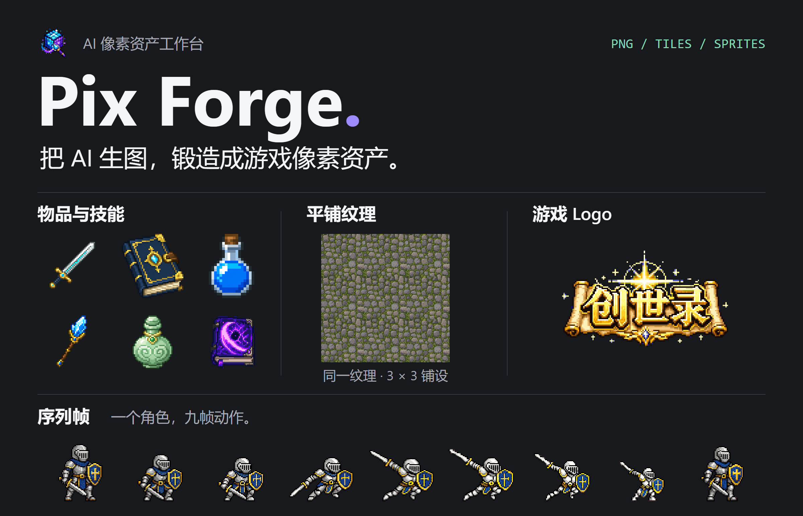

<p align="center">
  <a href="https://www.mcwar.cn/"></a>
</p>

<p align="center">
  <a href="https://github.com/zhibeigg/pix/actions/workflows/ci.yml"></a>
  <a href="https://github.com/zhibeigg/pix/releases"></a>
  <a href="LICENSE"></a>
  
  
</p>

<p align="center">
  <strong><a href="https://www.mcwar.cn/">在线体验</a></strong> ·
  <a href="#快速开始">本地运行</a> ·
  <a href="#docker-部署">Docker 部署</a> ·
  <a href="#对外-api">开放 API</a> ·
  <a href="docs/reference.md">完整文档</a>
</p>

**Pix Forge** 是面向游戏开发者与独立工作室的 AI 像素资产工作台。输入描述或参考图，经过生图、像素网格检测、去背景与尺寸整理，得到可继续用于游戏制作的素材；生成任务、作品库和导出在同一个 Web 界面中完成。

上图均为仓库中的真实产物：**物品与技能图标、平铺纹理、游戏 Logo、Sprite Sheet**。更多原图见[示例资产目录](apps/web/public/homepage-examples/)，来源与许可见 [ASSETS.md](ASSETS.md)。

## 核心能力

| 从什么开始 | 可以得到什么 |
| --- | --- |
| 描述、题材或参考图 | 物品图标、UI 组件、游戏 Logo、角色三视图与参考图重绘。 |
| 地表材质与过渡规则 | 可重复铺设的纹理、Dual Grid 过渡瓦片和应用预览。 |
| 角色与动作描述 | Mosaic 序列帧或视频补间，支持逐帧对齐、GIF 与多动作 ZIP 导出。 |
| 已有图片 | 本地像素化、去背景、限色、透明裁切和画布整理。 |
| 批量生产需求 | 多供应商配置与失败切换、异步任务、作品库、角色库和开放 API。 |

自部署版本还包含账号、点数、月卡、支付、公开分享、内容审核与管理后台。具体配置见[运营与管理文档](docs/reference.md#管理后台运营能力)。

## 生成技术路径

**描述 / 参考图 → AI 生图 → 像素网格检测 → 按素材类型后处理 → 素材导出**

Pix 的核心是把生成图整理成像素资产。Perfect Pixel 检测实际像素网格；后续根据素材类型执行去背景、透明裁切、调色板处理、尺寸规范化或序列帧拆分。纹理与 Dual Grid 使用各自的生成约束。

AI 输出仍需检查，实际尺寸、边缘与动作一致性会受模型和输入影响。详见[十条生成路径](docs/reference.md#生成技术路径)、[核心算法](docs/reference.md#核心算法解析)与 [Dual Grid 规则](docs/dual-grid-rules.md)。

## 快速开始

需要 **Python 3.10–3.12**、[uv](https://docs.astral.sh/uv/) 和 **Node.js ≥ 22.12**。本地默认使用 SQLite 和数据库队列，无需先安装 PostgreSQL 或 Redis。AI 生成需要自行配置可用的生图服务及 API Key，上游服务可能收费。

### 1. 安装并启动 API

在仓库根目录执行。已有 `.env` 时跳过复制，保留自己的配置。

```bash
uv sync --frozen --extra dev
cp .env.example .env
```

清空 `.env` 中的示例密钥 `PACKY_API_KEY=sk-xxxxxxxxxxxxxxxx`，或替换为有效值；也可以在首次登录后通过管理后台配置供应商。

```bash
uv run pix-web-api
```

后端默认监听 `http://127.0.0.1:8000`，接口文档位于 [`/docs`](http://127.0.0.1:8000/docs)。

### 2. 启动任务 Worker

另开终端，在仓库根目录运行，并保持进程开启：

```bash
uv run pix-web-worker
```

API 接收任务，Worker 执行生成；缺少 Worker 时，任务会停留在队列中。Redis/RQ 部署使用 `uv run pix-web-rq-worker`，配置见[完整文档](docs/reference.md#关键环境变量)。

### 3. 启动前端

再开一个终端：

```bash
cd apps/web
npm ci
npm run dev
```

打开 **[http://localhost:5173](http://localhost:5173)**。Vite 已将 `/api` 代理到本地后端，默认开发流程无需额外配置 CORS。

### 4. 生成第一张素材

1. 按页面提示创建首个管理员。
2. 在「管理后台 → 上游供应商」配置有效 API Key，并启用该供应商。
3. 进入工作台，选择「物品图标」和该供应商支持的模型，填写描述并生成。
4. 在作品库查看结果并下载；需要更多测试点数时，可在「用户与点数」中调整。

> [!NOTE]
> 环境变量中的供应商配置只在首次初始化时导入数据库。之后请在「上游供应商」中修改，详见[供应商配置说明](docs/reference.md#关键环境变量)。

<details>
<summary>环境检查与前端构建</summary>

仓库根目录运行环境检查：

```bash
uv run pix-web-check
```

在 `apps/web` 中构建前端：

```bash
npm run build
```

输出目录为 `dist/web/`。测试和贡献流程见 [CONTRIBUTING.md](CONTRIBUTING.md)。

</details>

## Docker 部署

使用源码构建完整服务栈：

```bash
cp .env.production.example .env.production
# 编辑 .env.production 后启动
docker compose --env-file .env.production up --build
```

已有配置时跳过复制。启动前设置数据库密码、JWT secret、生图供应商及所需的邮件、支付配置。生产模式会校验密钥与会话安全设置。

正式发布部署支持不可变 GHCR 镜像 digest、数据库迁移、备份与后台更新。完整 bootstrap 步骤见 **[生产部署与更新](docs/reference.md#release-digest-部署与后台更新)**；环境变量见 [.env.production.example](.env.production.example)。

## 对外 API

通过长期 API Key 接入自己的工具或生产流程，支持细粒度权限、幂等创建任务、批量生成、参考图上传、进度查询和产物下载。

- 直连后端：`http://127.0.0.1:8000/external/v1`
- 经网站代理：`https://<你的域名>/api/external/v1`
- 完整请求示例、认证与下载方式：[API 参考](docs/reference.md#对外-api)

## 技术架构

React / Vite 前端连接 FastAPI；API 负责认证、任务与文件权限，异步 Worker 调用 `src/pix` 完成生成和后处理。支持 SQLite / PostgreSQL，以及数据库队列 / Redis + RQ。

```text
apps/web/       React 前端、工作台与作品库
src/pix_web/   FastAPI、任务调度与运营后台
src/pix/       生图、像素化与序列帧核心
migrations/    Alembic 数据库迁移
docs/          部署、算法与 API 参考
```

完整流程图见[架构文档](docs/reference.md#技术架构)。

## 文档导航

| 需要做什么 | 阅读入口 |
| --- | --- |
| 配置、部署和更新实例 | [环境变量](docs/reference.md#关键环境变量) · [Docker 与发布](docs/reference.md#docker-部署) |
| 了解素材处理方式 | [生成路径与算法](docs/reference.md#生成技术路径) · [Pipeline](docs/pipeline.md) |
| 制作瓦片与地形 | [平铺纹理](docs/tile-texture-prompt-rules.md) · [Dual Grid](docs/dual-grid-rules.md) |
| 配置供应商与 Prompt | [Provider 规范](docs/reference.md#通用生图-provider-调用规范) · [Prompt 规则](docs/reference.md#prompt-构建规则) |
| 管理账号、点数和分享 | [运营后台](docs/reference.md#管理后台运营能力) · [点数与充值](docs/reference.md#点数与充值) |
| 查看安全与素材边界 | [安全配置](docs/reference.md#安全与防护) · [SECURITY.md](SECURITY.md) · [ASSETS.md](ASSETS.md) |

## 贡献与许可

问题与建议欢迎提交 [Issue](https://github.com/zhibeigg/pix/issues)。参与开发前请阅读[贡献指南](CONTRIBUTING.md)与[行为准则](CODE_OF_CONDUCT.md)；版本和变更见 [Releases](https://github.com/zhibeigg/pix/releases) 与 [CHANGELOG.md](CHANGELOG.md)。

代码采用 **[MIT License](LICENSE)**。仓库示例资产的授权和第三方名称说明见 [ASSETS.md](ASSETS.md)；使用外部模型与参考素材时，还需遵守各自的服务条款。

### 特别鸣谢

感谢 **[Poke API](https://www.poke2api.com/)** 对本项目的支持。
